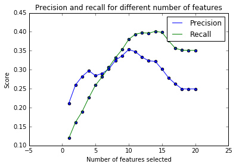

# Enron Fraud Detectors using Enron Emails and Financial Data

Xiaodong TAN

In 2000, Enron was one of the largest companies in the United States. By 2002, it had collapsed into bankruptcy due to widespread corporate fraud. In the resulting Federal investigation, a significant amount of typically confidential information entered into the public record, including tens of thousands of emails and detailed financial data for top executives. In this project, the purpose of this project is to build a person of interest identifier based on financial and email data made public as a result of the Enron scandal. 

## 1. Summarize for us the goal of this project and how machine learning is useful in trying to accomplish it. As part of your answer, give some background on the dataset and how it can be used to answer the project question. Were there any outliers in the data when you got it, and how did you handle those? 

The goal of this project is to identify if an individuial is a person of interest based on his/her financial features and/or email features. Machine learning algorithms can help learn from the features of a known POI and precict if an unknown individual is POI or not.

The dataset contains records of 146 individuals, most of whom were senior management. Each record contains one lable (poi, i.e., if the person is a person of interest), 14 financial features and 6 email features. An exploration of the dataset revealed that there are 18 PoI among the 146 records. For each features, there are a number of missing values as follows.

| Feature | Number of missing values |
| :--- | :----------------------: |
| Loan advances | 142 |
| Director fees | 129 |
| Restricted stock deferred | 128 |
| Deferred payment | 107 |
| Deferred income  | 97 |
| Long term incentive | 80 |
| Bonus | 64 |
| Emails sent also to POI   | 60 |
| Emails sent | 60 |
| Emails received | 60 |
| Emails from POI | 60 |
| Emails to POI | 60 |
| Other | 53 |
| Expenses | 51 |
| Salary | 51 |
| Excersised stock option | 44 |
| Restricted stock | 36 |
| Email address | 35 |
| Total payment | 21 |
| Total stock value | 20 |


By using plotting and data exploration, I identified three outliners.

- TOTAL: the values of all the features are significantlly larger than that of all the other records. The record is likely to be a sum of all the other records. 
- THE TRAVEL AGENCY IN THE PARK: it does not seem to be an individual's name. There are no values for 18 out of 20 features.
- LOCKHART EUGENE E: There are no values for all the features.
    

## 2. What features did you end up using in your POI identifier, and what selection process did you use to pick them? Did you have to do any scaling? Why or why not?As part of the assignment, you should attempt to engineer your own feature that does not come ready-made in the dataset -- explain what feature you tried to make, and the rationale behind it.

There are 14 financial features and 6 email features (one of which is the email address) for each record. I added one more email feature, which is the percentage of emails involving poi among all the emails. This feature measures the communication between the individual and a poi. 

Different algorithms may present different sets of features that maximize their performance. To find the best number of features for each algorithm, I applied scikit-learn's SelectKBest to each algorithm and used gridsearch to find the best k. For the chosen logistic regression algorithm, k = 10 was chosen by gridsearch. As is shown in the chart below, for logistic regression algorithm, the score of recall is highest when 10-15 features are selected, while the score of precision reaches its peak when k = 10 and is significantly lower when other values are chosen. As a result, it is justifiable to choose k = 10 for the algorithm.



The scores for the best ten features selected are as follows.

| Selected Features       | Score↑ |
| :---------------------- | :----: |
| exercised_stock_options | 24.815 |
| total_stock_value       | 24.183 |
| bonus                   | 20.792 |
| salary                  | 18.289 |
| deferred_income         | 11.458 |
| long_term_incentive     |  9.922 |
| restricted_stock        |  9.213 |
| total_payments          |  8.772 |
| shared_receipt_with_poi |  8.589 |
| loan_advances           |  7.184 |

It was noticed that 9 out of the 10 selected features are financial features. Only one email feature "shared_receipt with poi" is selected. 

It was also noticed that the newly created feature was not among the 10 best features and its score is 5.4. In fact, a test on the final algorithm using the 10 selected features and 11 features (10 selecte features plus the created feature) revealed that adding the new feature makes the performance of the algorithm slightly worse.

|                              |Precision |Recall |F1     |
|------------------------------|----------|-------|-------|
|10 features                   |0.38147   |0.38700|0.38421|
|10 features + 1 new feature   |0.35243   |0.36300|0.35764|

For SVM and logistic regression, I did feature scaling to standardize the range of features using skit-learn's StandardScaler() function. Scaling is typically required for SVM and logistic regression. For algorithms like decision tree and random forest, the performance is not affected by scaling.

## 3. What algorithm did you end up using? What other one(s) did you try? How did model performance differ between algorithms? 

I tried naive bayes, logistic regression, svm, decision tree, and random forest. The performance of each algorithm with default parameters are as follows. Surprisingly, naive bayes got the best performance (both pecision and recall are above 0.3). The performance of the algorithms with default setting are shown as follows. (SVM does not have valid performance due to the insufficient number of true results)

|                   |Precision |Recall |F1     |
|-------------------|----------|-------|-------|
|Naive Bayes        |0.40602   |0.30350|0.34735|
|Logistic regression|0.42765   |0.16550|0.23864|
|SVM                |-         |-      |-      |
|Decision tree      |0.26522   |0.26350|0.26436|
|Random forest      |0.38295   |0.14150|0.20664|

After tuning the parameters of each algorithm (exept for naive bayes), the performance of all the algorithms improved significantlly as follows.

|                   |Precision |Recall |F1     |
|-------------------|----------|-------|-------|
|Logistic regression|0.35569   |0.40300|0.37787|
|SVM                |0.32908   |0.55500|0.41318|
|Decision tree      |0.33910   |0.31350|0.32580|
|Random forest      |0.53014   |0.27700|0.36388|


Among all the algorithms, SVM has the best recall but the worst precision; random forest has the best precision but worst recall.As Logistic regression has the second best precision and recall, both of which are above 0.3, I chose logistic regression in the end.

## 4. What does it mean to tune the parameters of an algorithm, and what can happen if you don’t do this well?  How did you tune the parameters of your particular algorithm? 

The parameters of an algorithm can be tuned to improve its performance on the testing set. The performance can be much worse if the parameters are not tuned (such as what happened in for SVM in this project)

Ideally, if I would like to tune the parameters of each algorithm and then compare the performance of the algorithms, I should divide the dataset into training set, cross-validation set and testing set. I should train the model with selected parameters using the training set, and test the result using cross-validation set to find the best parameters. Then for all the algorithms, the performance of the tuned parameters should be compared using the results from the testing set. As the dataset is very small, stratifiedShuffleSplit is preferred, then the whole process becomes nested-crossvalidation, which can be complicated.

For simiplicity, in this project, I simply used StratifiedShuffleSplit to divide the whole dataset into training set and validation set, and conducted 1000 trials. In each trial, GridSearchCV of scikitlearn was used to tune the parameters.

The parameters chosen to be tuned for each algorithm are as follows.

```python
#Logistic regression    
parameters = {'kbf__k':range(1,21),
              'clf__penalty': ['l1', 'l2'], 
              'clf__C': np.logspace(-10, 0, 11), 
              'clf__random_state': [0]} 

#SVM
parameters = {'kbf__k':range(1,21),
              'clf__kernel':['rbf'], 
              'clf__C':[0.1,1,10,100,1000], 
              'clf__tol': [1e-1, 1e-2, 1e-4, 1e-5],
              'clf__gamma': np.logspace(-5,0,6),
              'clf__class_weight': ['balanced']}  
    
#Decision tree
parameters = {'kbf__k':range(1,21),
              "clf__min_samples_leaf": [2, 6, 10, 12],
              "clf__min_samples_split": [2, 6, 10, 12],
              "clf__criterion": ["entropy", "gini"],
              "clf__max_depth": [None, 5],
              "clf__random_state": [0]}

#Random forest
parameters = {'kbf__k':range(1,21),
              'clf__max_depth': [None, 5, 10],
              'clf__n_estimators': [10, 15, 20, 25],
              'clf__random_state': [0]}

```

The tuned parameters for each algorithms are as follows.

```python
#Logistic Regression
lr_clf_tuned = Pipeline(steps=[('kbf', SelectKBest(k=10)),
                               ('scaler', StandardScaler()), 
                               ('clf', LogisticRegression(penalty = 'l2', 
                                                          C = 0.0001, 
                                                          random_state = 0))])

#SVM 
s_clf_tuned = Pipeline(steps=[('kbf', SelectKBest(k=20)),
                              ('scaler', StandardScaler()), 
                              ('clf', SVC(gamma= 0.001,
                                          C=1000,
                                          tol=0.0001,
                                          class_weight='balanced',
                                          kernel='rbf'))])                                                                         

#Naive Bayes (default parameters)
nb_clf_pl = Pipeline(steps=[('kbf', SelectKBest()),
                            ('clf', GaussianNB())])

#Decision Tree
dt_clf_tuned = Pipeline(steps=[('kbf', SelectKBest(k=15)),
                               ('clf', DecisionTreeClassifier(criterion='entropy', 
                                                               max_depth=None, 
                                                               min_samples_leaf=12,
                                                               min_samples_split=2, 
                                                               random_state=0))])

#Random Forest
rf_clf_tuned = Pipeline(steps=[('kbf', SelectKBest(k=3)),
                               ('clf', RandomForestClassifier(max_depth=None, 
                                                               random_state=0, 
                                                               n_estimators=25))])

```

## 5. What is validation, and what’s a classic mistake you can make if you do it wrong? How did you validate your analysis? 

Validation is basically testing if the model trained from one part of the dataset can be generalized to the other part. If validation is not conducted, the model might be over-fitting, which means it can't be generalized to dataset other than the training set.

In this project, due to the small size of the dataset, I used the StratifiedSuffleSplit method to randamly divide the whole dataset into training set and testing set, and conducted 1000 trials. By doing this, both the training set and test set can include much more samples than conducting a one-shot division.


## 6. Give at least 2 evaluation metrics and your average performance for each of them.  Explain an interpretation of your metrics that says something human-understandable about your algorithm’s performance. 

I used three evaluation metrics, namely precision, recall and F1-Score. They are caculated as follows.

    True Positive (TP) : Case is positive and predicted positive
    True Negative (TN) : case is negative and predicted negative
    False Positive (FP) : Case is negative but predicted positive
    False Negative (FN) : Case is positive but predicted negative

Precision : TP/(TP + FP), which calculates the percentage of true positive among all the precited positive.  A good algorithm has high precision. In this project, it means among all the predicted POI, a lot of them are real POI.

Recall : TP/(TP + FN), which calculates among all the true positive cases, how many percentage are predicted as positive. A good algorithm has higher recall. In this project, it means the algorithm can idendity more POI from real POI.

F1-score : (2 * recall * precision)/(recall + precision). It ranges from 0 (worst performance) and 1 (best performance).

## Reference
https://sebastianraschka.com/faq/docs/evaluate-a-model.html
http://scikit-learn.org/stable/documentation.html
http://sebastianraschka.com/Articles/2014_about_feature_scaling.html
For details of the implmentation, please see P5_Enron.html


